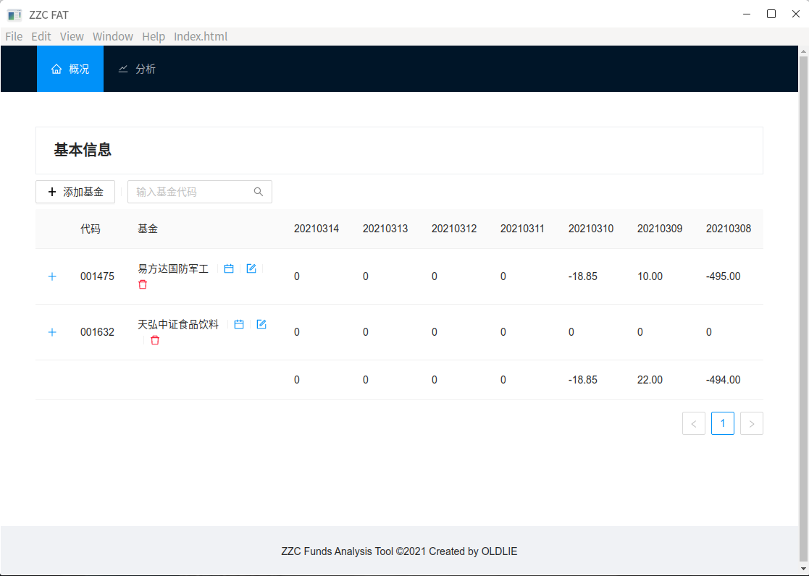
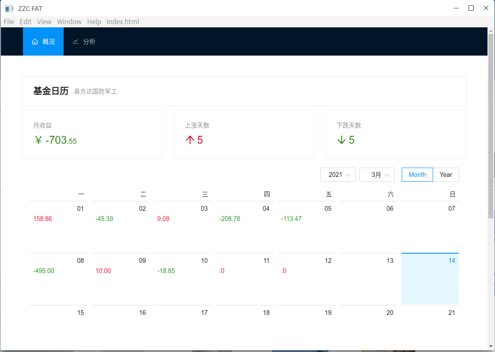
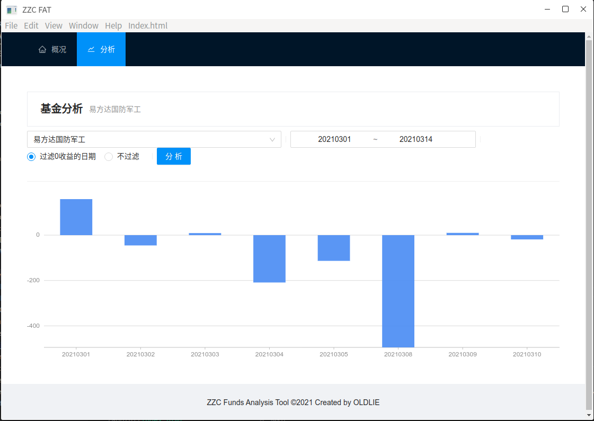

# zzc基金分析工具

#### 介绍
zzc基金分析工具

#### 软件架构
1.  UI: vue3
2.  Backend: Electron
3.  前后端采用事件的方式通信


#### 安装教程

1.  去到fund-ui执行```npm install```安装依赖
2.  执行```npm run build```将前端项目编译到app的指定文件夹
3.  去到app文件夹执行```npm install```安装依赖
4.  执行```npm start```启动程序

#### 使用说明

1.  基本信息
    
2.  基金日历
    
3.  基金分析
    

#### 参与贡献

1.  Fork 本仓库
2.  新建 Feat_xxx 分支
3.  提交代码
4.  新建 Pull Request


#### 特技

1.  使用 Readme\_XXX.md 来支持不同的语言，例如 Readme\_en.md, Readme\_zh.md
2.  Gitee 官方博客 [blog.gitee.com](https://blog.gitee.com)
3.  你可以 [https://gitee.com/explore](https://gitee.com/explore) 这个地址来了解 Gitee 上的优秀开源项目
4.  [GVP](https://gitee.com/gvp) 全称是 Gitee 最有价值开源项目，是综合评定出的优秀开源项目
5.  Gitee 官方提供的使用手册 [https://gitee.com/help](https://gitee.com/help)
6.  Gitee 封面人物是一档用来展示 Gitee 会员风采的栏目 [https://gitee.com/gitee-stars/](https://gitee.com/gitee-stars/)
